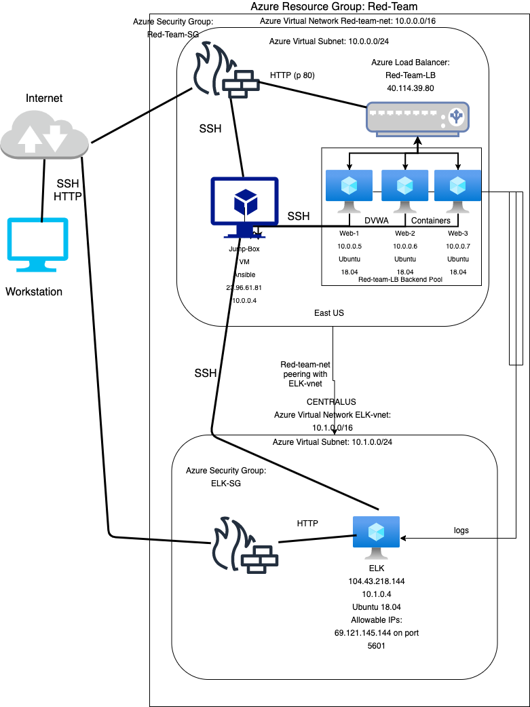

## Automated ELK Stack Deployment

The files in this repository were used to configure the network depicted below.

These files have been tested and used to generate a live ELK deployment on Azure. They can be used to either recreate the entire deployment pictured above. Alternatively, select portions of the .yaml file may be used to install only certain pieces of it, such as Filebeat.

  - install-elk.yml
  -pentest.yml
  -filebeat-metricbeat-playbook.yml

This document contains the following details:
- Description of the Topology
- Access Policies
- ELK Configuration
  - Beats in Use
  - Machines Being Monitored
- How to Use the Ansible Build

### Description of the Topology

The main purpose of this network is to expose a load-balanced and monitored instance of DVWA, the D*mn Vulnerable Web Application.

Load balancing ensures that the application will be highly available, in addition to restricting access to the network.
-  What aspect of security do load balancers protect? What is the advantage of a jump box? 
The load balancer helps to protect the system from DOS attacks.  It also gives the VMS in the pool a forward facing IP that is accessed by the internet.
This allows for if, say one of the web VMs goes down the load balancer can redirect traffic to the other machines in the pool.  The advantage of a jump box is that it protects the web-vms so that they are 
Not public facing.  Especially since we installed DVWA on the web-vms.

Integrating an ELK server allows users to easily monitor the vulnerable VMs for changes to the logs and system traffic.
- Filebeat monitors files for suspicious activity.
- Metricbeat collects machine metrics.

The configuration details of each machine may be found below.
_Note: Use the [Markdown Table Generator](http://www.tablesgenerator.com/markdown_tables) to add/remove values from the table_.

| Name     | Function   | IP address | Operating System |
|----------|------------|------------|------------------|
| Jump Box | Gateway    | 10.0.0.4   | Linux            |
| Web-1    | Webserver  | 10.0.0.5   | Linux            |
| Web-2    | Webserver  | 10.0.0.6   | Linux            |
| Web-3    | Webserver  | 10.0.0.7   | Linux            |
| Elk      | ELK server | 10.1.0.4   | Linux            | |

### Access Policies

The machines on the internal network are not exposed to the public Internet. 

Only the Jump Box machine can accept connections from the Internet. Access to this machine is only allowed from the following IP addresses:
- My IP

Machines within the network can only be accessed by the Jump Box.
- Which machine did you allow to access your ELK VM? What was its IP address? 
   The Jump box - 10.0.0.4

A summary of the access policies in place can be found in the table below.

| Name     | Publicly Accessible | Allowed IP Addresses    |
|----------|---------------------|-------------------------|
| Jump box | Yes                 | My Ip                   |
| Web-1    | No                  | 10.0.0.4                |
| Web-2    | No                  | 10.0.0.4                |
| Web-3    | No                  | 10.0.0.4                |
| Elk-VM   | HTTP:5601 No SSH    | 10.0.0.4                |

### Elk Configuration

Ansible was used to automate configuration of the ELK machine. No configuration was performed manually, which is advantageous because Ansible allows for us to make one playbook to configure any number of machines meaning if we make one mistake in we can end up breaking every machine.
- What is the main advantage of automating configuration with Ansible?
  The Main advantage of automating with Ansible is that it saves time, effort and is easy to use.  It would be tedious and a waste of time to manually configure each machine on a network Ansible helps to save time and money.

The playbook implements the following tasks:
- Install Docker.io
- Install Python3-pip
- Install Docker module
- Increase Virtual memory
- Download and launch Docker Elk Container
- Enable service docker on boot

The following screenshot displays the result of running `docker ps` after successfully configuring the ELK instance.

### Target Machines & Beats
This ELK server is configured to monitor the following machines:
-10.0.0.5 
-10.0.0.6 
-10.0.0.7

We have installed the following Beats on these machines:
- Filebeat
- Metricbeat

These Beats allow us to collect the following information from each machine:
-Filebeat is a lightweight shipper for forwarding and centralizing log data.  It will send data about the file system such as which files have been changed and when too Logstash and Elasticsearch.
- Metricbeat will collect machine metrics such as uptime and CPU usage.

### Using the Playbook
In order to use the playbook, you will need to have an Ansible control node already configured. Assuming you have such a control node provisioned: 

SSH into the control node and follow the steps below:
- Copy the .yml files to /etc/ansible 
- Update the ansible.cfg file by changing remote_user=[username used for all machines]
- Update the hosts file in /etc/ansible to include :

	[webservers] [] 
	10.0.0.5 ansible_python_interpreter=/usr/bin/python3
        10.0.0.6 ansible_python_interpreter=/usr/bin/python3
        10.0.0.7 ansible_python_interpreter=/usr/bin/python3
    
       [elk]
        10.1.0.4 ansible_python_interpreter=/usr/bin/python3

- Run the playbooks, and navigate to http://[Load-balancer-IP]/setup.php to check that the installation worked as expected.

_TODO: Answer the following questions to fill in the blanks:_
- _Which file is the playbook? Where do you copy it? The .yml files are the playbooks and you copy them to /etc/ansible 
- _Which file do you update to make Ansible run the playbook on a specific machine? How do I specify which machine to install the ELK server on versus which to install Filebeat on? You edit the hosts file located in /etc/ansible.  You specify the machine to install elk on by adding that machines private ip under the [elk] tab to specify the machines to install filebeat on you simply add those machines private IPs under the [webservers] tag in the /etc/ansible/host file along with ansible_python_interpreter=/usr/bin/python3 after each IP.
- To check if the ELK server is running, navigate to http://[your.Elk-VM.IP]:5601/app/kibana

